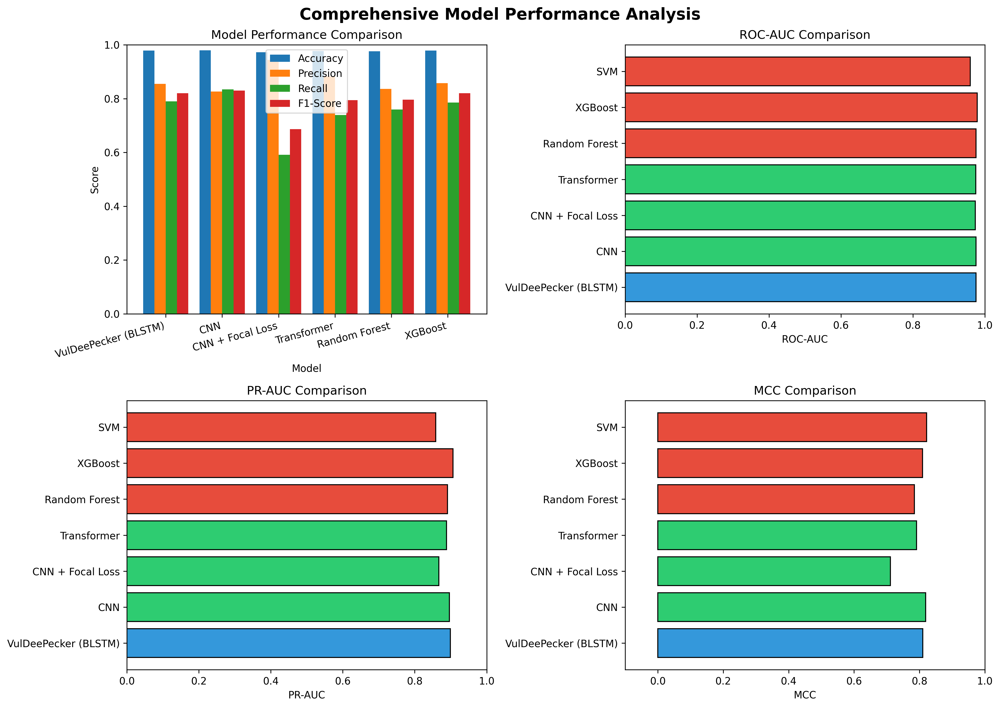

# EMPIRICAL STUDY on SOFTWARE VULNERABILITY DETECTION

## An Evaluation of 7 Models on the VulDeePecker Dataset

[](https://opensource.org/licenses/MIT)
[](https://www.python.org/downloads/)
[](https://pytorch.org/)
[](https://doi.org/10.5281/zenodo.XXXXXXX)

---

## 📖 Overview

This repository contains the complete code and results for the paper:

> **"Deep Learning-Based Software Vulnerability Detection Using CNN and Transformer Models: An Empirical Study on the VulDeePecker Dataset"**

We evaluate **7 models** on the VulDeePecker dataset (128,118 code gadgets) for binary vulnerability detection. The study addresses class imbalance using Focal Loss and reports comprehensive metrics including accuracy, precision, recall, F1-score, ROC-AUC, PR-AUC, and MCC with 5-fold cross-validation.

### Key Findings

| Model | Accuracy | Recall | ROC-AUC | PR-AUC | MCC |
|-------|----------|--------|---------|--------|-----|
| **SVM** | **97.92%** | **84.92%** | 95.96% | 85.87% | **82.17%** |
| **CNN** | **97.92%** | 83.44% | **97.55%** | 89.62% | 81.91% |
| XGBoost | 97.90% | 78.50% | **97.89%** | **90.61%** | 80.95% |

### Models Evaluated

- **VulDeePecker (BLSTM)** – Original architecture from NDSS 2018
- **CNN** – Proposed architecture with 3 convolutional layers
- **Transformer** – 3-layer encoder with 8 attention heads
- **CNN + Focal Loss** – CNN with Focal Loss for class imbalance
- **Random Forest** – 100 estimators
- **XGBoost** – 100 estimators with log loss evaluation
- **SVM** – RBF kernel with probability estimates

---

## 🚀 Getting Started

### System Requirements

- **Operating System**: Linux, macOS, or Windows 10+
- **Python**: 3.8 or higher
- **RAM**: 16GB+ recommended
- **GPU**: NVIDIA GPU with 8GB+ VRAM (optional but recommended)

### Installation

1. **Clone the repository:**
   ```bash
   git clone https://github.com/your-username/vuldeepecker-empirical-study.git
   cd vuldeepecker-empirical-study
   ```
2. **Create a virtual environment:**
   ```bash
   python -m venv venv
   source venv/bin/activate  # On Windows: venv\Scripts\activate
   ```
3. **Install dependencies:**
   ```bash
   pip install -r requirements.txt
   ```

   ### Data Access

The VulDeePecker dataset is publicly available on Hugging Face:

```python
from datasets import load_dataset
dataset = load_dataset("claudios/VulDeePecker", split="train")
```
The dataset contains 128,118 code gadgets with 7,791 vulnerable samples (6.1%) and 120,327 safe samples (93.9%).

### Running the Experiments

**1. Train all models with cross-validation:**
```bash
python src/main.py --all-models --cv-folds 5
```
**2. Train a specific model:**
```bash
python src/main.py --model cnn --epochs 25 --batch-size 64
```
**3. Run the ablation study:**
```bash
python src/main.py --ablation --dimensions 100 200 500 1000
```
**4. Generate evaluation results:**
```bash
python src/evaluation/generate_results.py
```

### Quick Demo

For a quick test with a smaller subset:
```python
from src.models.cnn import VulnerabilityCNN
from src.evaluation.metrics import calculate_metrics
from src.utils.data_loader import load_dataset

# Load sample data
X_train, X_test, y_train, y_test = load_data(sample_size=10000)

# Train CNN
model = VulnerabilityCNN(input_dim=500)
model.fit(X_train, y_train, epochs=5)

# Evaluate
metrics = calculate_metrics(y_test, model.predict(X_test))
print(metrics)
```

---
## 📊 Results

### Model Performance Comparison

| Model | Accuracy | Precision | Recall | F1-Score | ROC-AUC | PR-AUC | MCC |
|-------|----------|-----------|--------|----------|---------|--------|-----|
| **SVM** | **0.9792** | 0.8167 | **0.8492** | **0.8326** | 0.9596 | 0.8587 | **0.8217** |
| **CNN** | **0.9792** | 0.8266 | 0.8344 | 0.8296 | 0.9755 | 0.8962 | 0.8191 |
| XGBoost | 0.9790 | 0.8576 | 0.7850 | 0.8197 | **0.9789** | **0.9061** | 0.8095 |
| VulDeePecker (BLSTM) | 0.9789 | 0.8553 | 0.7901 | 0.8197 | 0.9755 | 0.8991 | 0.8102 |
| Transformer | 0.9771 | 0.8828 | 0.7391 | 0.7939 | 0.9744 | 0.8886 | 0.7913 |
| Random Forest | 0.9764 | 0.8362 | 0.7599 | 0.7962 | 0.9752 | 0.8912 | 0.7847 |
| CNN + Focal Loss | 0.9720 | **0.9443** | 0.5916 | 0.6870 | 0.9734 | 0.8671 | 0.7112 |

### Ablation Study

| TF-IDF Feature Dimension | CNN Accuracy |
|--------------------------|--------------|
| 100 | 93.93% |
| 200 | 93.93% |
| 500 | 93.93% |
| 1000 | 93.93% |

### Key Figures

<p align="center">
  
  <br>
  <em>Figure 1: Model performance comparison across all metrics.</em>
</p>

<p align="center">
  
  <br>
  <em>Figure 2: Confusion matrix for the CNN model.</em>
</p>
